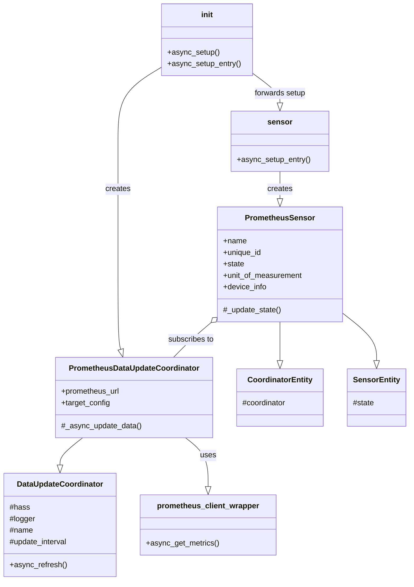

# Home Assistant Prometheus Integration: Technical Specification

**Version:** 0.1.0
**Date:** 2025-06-13

### 1. Introduction

This document outlines the architecture for a Home Assistant integration that connects to a Prometheus server, fetches metrics, and maps them to Home Assistant sensor entities. The integration will allow users to define Prometheus targets and associate them with Home Assistant devices.

### 2. Integration Configuration Schema

The integration will be configured via the `configuration.yaml` file.

```yaml
prometheus_provider:
  prometheus_url: "http://your-prometheus-server:9090"
  scrape_interval: 60 # Optional, in seconds, defaults to 60
  targets:
    - target_name: "Node Exporter - Server 1" # User-defined name for this target group
      job_name: "node_exporter" # The Prometheus job name to filter metrics
      instance_label: "instance" # The label Prometheus uses to identify the specific instance (e.g., 'instance', 'kubernetes_pod_name')
      instance_value: "server1.example.com:9100" # The specific value of the instance_label for this target
      device_id: "prometheus_server_1" # A unique ID for the HA device
      device_name: "Prometheus Server 1" # Friendly name for the HA device
      device_manufacturer: "Prometheus" # Optional
      device_model: "Node Exporter" # Optional
      # metrics_prefix: "node_" # Optional: Only create sensors for metrics starting with this prefix
      # included_metrics: # Optional: Explicit list of metrics to include
      #   - "node_cpu_seconds_total"
      #   - "node_memory_MemAvailable_bytes"
      # excluded_metrics: # Optional: Explicit list of metrics to exclude
      #  - "go_goroutines"
    - target_name: "My Application - Service A"
      job_name: "my_app"
      instance_label: "instance"
      instance_value: "service-a-pod-1234:8080"
      device_id: "prometheus_service_a"
      device_name: "Prometheus Service A"
      # metrics_filter: # Optional: Advanced filtering using PromQL label selectors for this target
      #   app: "service-a"
      #   env: "production"
```

**Configuration Fields:**

*   **`prometheus_url`** (Required, string): The base URL of the Prometheus server (e.g., `http://localhost:9090`).
*   **`scrape_interval`** (Optional, integer): Frequency in seconds at which to fetch data from Prometheus. Defaults to 60 seconds.
*   **`targets`** (Required, list): A list of Prometheus target configurations. Each item in the list defines a mapping to a Home Assistant device.
    *   **`target_name`** (Required, string): A user-friendly name for this target configuration entry.
    *   **`job_name`** (Required, string): The Prometheus `job` label value associated with the target. This is used to query specific metrics for this target.
    *   **`instance_label`** (Required, string): The name of the Prometheus label that uniquely identifies the instance of the job (e.g., `instance`, `pod`, `host`).
    *   **`instance_value`** (Required, string): The specific value of the `instance_label` for the target instance you want to monitor (e.g., `server1.example.com:9100`, `my-app-pod-xyz123`).
    *   **`device_id`** (Required, string): A unique identifier for the Home Assistant device that will be created. Should be slug-friendly (e.g., `prometheus_node_server1`).
    *   **`device_name`** (Required, string): A friendly name for the Home Assistant device (e.g., "Prometheus Node Server 1").
    *   **`device_manufacturer`** (Optional, string): Manufacturer of the device.
    *   **`device_model`** (Optional, string): Model of the device.
    *   **`metrics_prefix`** (Optional, string): If specified, only metrics whose names start with this prefix will be considered for sensor creation for this target.
    *   **`included_metrics`** (Optional, list of strings): A list of specific metric names to include. If defined, only these metrics (matching other criteria) will be created.
    *   **`excluded_metrics`** (Optional, list of strings): A list of specific metric names to exclude from sensor creation.
    *   **`metrics_filter`** (Optional, map): Advanced filtering using PromQL-style label selectors (key-value pairs) to further refine which metrics are fetched for this target. Example: `{ "env": "production", "region": "us-west" }`.

### 3. Component Structure

The integration will reside in `custom_components/prometheus_provider/`.

*   **`__init__.py`**:
    *   Purpose: Main entry point for the integration. Handles setup and unloading of the integration.
    *   Key Classes/Functions:
        *   `async_setup(hass, config)`: Sets up the integration from `configuration.yaml`.
        *   `async_setup_entry(hass, entry)`: Sets up the integration from a config entry (if UI config is added later).
        *   `async_unload_entry(hass, entry)`: Unloads a config entry.
*   **`manifest.json`**:
    *   Purpose: Provides metadata about the integration.
    *   Content: Domain name, version, dependencies, code owners, requirements, IoT class.
*   **`const.py`**:
    *   Purpose: Stores constants used across the integration.
    *   Content: `DOMAIN`, `CONF_PROMETHEUS_URL`, `CONF_TARGETS`, `DEFAULT_SCRAPE_INTERVAL`, etc.
*   **`sensor.py`**:
    *   Purpose: Defines the sensor platform and sensor entities.
    *   Key Classes:
        *   `async_setup_entry(hass, config_entry, async_add_entities)`: Sets up sensor entities.
        *   `PrometheusSensor(CoordinatorEntity)`: Base class or specific implementation for Prometheus sensors. Inherits from `SensorEntity` and `CoordinatorEntity` for data updates.
            *   Properties: `name`, `unique_id`, `state`, `unit_of_measurement`, `device_class`, `icon`, `extra_state_attributes`, `device_info`.
*   **`coordinator.py`** (New file):
    *   Purpose: Manages data fetching and updates for sensors associated with a Prometheus target.
    *   Key Classes:
        *   `PrometheusDataUpdateCoordinator(DataUpdateCoordinator)`:
            *   Handles scheduled fetching of data from Prometheus for a specific target configuration.
            *   Processes the fetched metrics.
            *   Provides data to linked `PrometheusSensor` entities.
*   **`prometheus_client_wrapper.py`** (New file, or utility functions within `coordinator.py`):
    *   Purpose: Abstracts communication with the Prometheus HTTP API.
    *   Key Functions:
        *   `async_get_metrics(prometheus_url, job_name, instance_label, instance_value, metrics_filter)`: Fetches all current metric values for a given job and instance, applying filters.
        *   Parses the Prometheus exposition format or API response.

**Class Relationships (Simplified Mermaid Diagram):**



### 4. Data Flow

1.  **Initialization (`async_setup` / `async_setup_entry` in `__init__.py`):**
    *   Reads configuration from `configuration.yaml`.
    *   For each entry in `targets`:
        *   Creates an instance of `PrometheusDataUpdateCoordinator`.
        *   The coordinator is initialized with the `prometheus_url` and the specific target's configuration (job, instance, filters, device info).
        *   The coordinator schedules its first data fetch.
    *   Forwards the setup to the `sensor` platform, passing the coordinator instances.

2.  **Data Fetching (PrometheusDataUpdateCoordinator):**
    *   Periodically (based on `scrape_interval`), the `_async_update_data()` method in the coordinator is called.
    *   It uses `prometheus_client_wrapper.async_get_metrics()` to make an HTTP GET request to the Prometheus server's `/api/v1/query` or `/api/v1/series` + `/api/v1/query` (for current values) endpoint, or directly scrapes a target's `/metrics` endpoint if simpler and sufficient (though API is generally more robust for filtering). A query like ` {job="<job_name>", <instance_label>="<instance_value>", ...<metrics_filter>} ` would be used.
    *   The response (typically JSON from the API) contains a list of metrics, their labels, and current values.

3.  **Metric Processing and Sensor Creation (Sensor Platform & Coordinator):**
    *   **Initial Setup (`sensor.async_setup_entry`):**
        *   When the sensor platform is set up for a config entry (representing one `PrometheusDataUpdateCoordinator`), it performs an initial fetch or uses initially fetched data from the coordinator.
        *   For each metric returned by Prometheus that matches the target's configuration (job, instance, prefix, include/exclude lists):
            *   A unique ID for the sensor is generated based on the `device_id`, metric name, and all its labels (e.g., `prometheus_server_1_node_cpu_seconds_total_cpu_0_mode_idle`).
            *   A `PrometheusSensor` entity is created.
            *   The sensor is associated with the correct Home Assistant device (defined in the target config).
            *   `async_add_entities` is called to add these new sensors to Home Assistant.
    *   **Data Updates (PrometheusDataUpdateCoordinator & PrometheusSensor):**
        *   When the coordinator fetches new data:
            *   It processes the list of metrics.
            *   For each `PrometheusSensor` subscribed to it, the sensor's state and attributes are updated based on the new metric value.
            *   Home Assistant is notified of the state changes.
        *   **Dynamic Sensor Handling:** If new metrics appear for a target (e.g., a new network interface appears on a node), the coordinator should identify these. The sensor setup logic might need to be re-triggered or a mechanism to dynamically add new sensors will be required. This is a more advanced feature; initially, sensors might only be created at startup. For simplicity in v0.1, we might only create sensors discovered during the initial setup.

4.  **Sensor Entity (`PrometheusSensor`):**
    *   Stores its current state (the metric value).
    *   Extracts `unit_of_measurement` from metric names if conventions are followed (e.g., `_bytes`, `_seconds`, `_total`, `_ratio`). This might require a helper function.
    *   Sets `device_class` based on unit or metric name (e.g., `DeviceClass.TEMPERATURE` if `_celsius` or `_fahrenheit`).
    *   All Prometheus labels for the metric are stored in `extra_state_attributes`.
    *   `unique_id` is crucial and must be stable: `f"{device_id}_{metric_name_sanitized}_{'_'.join(sorted(f'{k}_{v}' for k, v in labels.items()))}"`.
    *   `name` will be a user-friendly version, e.g., "Server 1 CPU Usage (core 0, idle)".

### 5. Technical Specifications

*   **Home Assistant Core Interfaces/Classes:**
    *   `homeassistant.config_entries.ConfigEntry`: For managing configuration.
    *   `homeassistant.helpers.aiohttp_client.async_get_clientsession`: For making HTTP requests.
    *   `homeassistant.helpers.update_coordinator.DataUpdateCoordinator`: To manage data fetching and updates.
    *   `homeassistant.helpers.update_coordinator.CoordinatorEntity`: Base class for entities using a coordinator.
    *   `homeassistant.components.sensor.SensorEntity`: Base class for sensor entities.
    *   `homeassistant.components.sensor.SensorDeviceClass`: For `device_class` attribute.
    *   `homeassistant.components.sensor.SensorStateClass`: For `state_class` (e.g., `MEASUREMENT`, `TOTAL_INCREASING`).
    *   `homeassistant.const`: For common constants (e.g., `CONF_URL`, `STATE_UNKNOWN`).
    *   `homeassistant.helpers.entity.DeviceInfo`: For linking sensors to a device.
*   **External Dependencies:**
    *   `aiohttp`: Already a Home Assistant dependency, used for asynchronous HTTP requests.
    *   (Potentially) `prometheus_client` (Python library): While we can manually query the HTTP API, this library offers parsers for the exposition format if we choose to scrape `/metrics` endpoints directly for some targets, or for more complex query building. However, for simple API queries, `aiohttp` alone might suffice. For now, let's assume direct API calls with `aiohttp`.
*   **Error Handling:**
    *   Connection errors to Prometheus should be handled gracefully, logging errors and setting sensor states to `unavailable` or `unknown`.
    *   Configuration errors should be validated and reported to the user.
*   **Metric Naming and Units:**
    *   The integration should attempt to infer units and device classes from common Prometheus metric naming conventions (e.g., `_bytes`, `_seconds`, `_total`, `_degrees`, `_ratio`, `_percent`).
    *   `state_class` should be set appropriately (e.g., `SensorStateClass.MEASUREMENT` for gauges, `SensorStateClass.TOTAL_INCREASING` for counters). This might require some heuristics based on metric names (e.g., if `_total` is in the name, it's likely a counter).

### 6. Future Considerations (Post v0.1)

*   **UI Configuration (Config Flow):** Allow users to add and configure Prometheus servers and targets via the Home Assistant UI.
*   **Service Calls:** Expose services (e.g., to force a refresh of a specific target).
*   **Dynamic Sensor Addition/Removal:** Handle metrics that appear or disappear after initial setup without requiring a restart.
*   **More Sophisticated Metric Filtering:** Allow complex PromQL queries per target.
*   **Authentication:** Support for Prometheus servers requiring authentication (e.g., Basic Auth, Bearer Token).
*   **Alerts:** Integrate with Prometheus alerting rules.